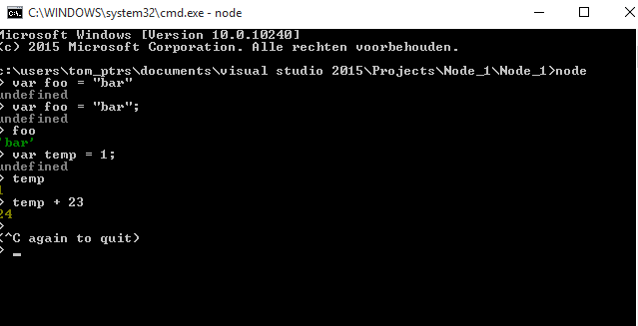
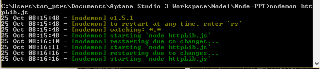

# NodeJS Info

## Wat?
Node.js is een platform dat gebaseerd is op de V8 JavaScript engine van Google 
Node.js is eigenlijk een back-end variant van de JavaScript die wij kennen (voor front-end development van websites). Dit platform zorgt voor snelle I/O events zoals web calls, netwerk communicatie, files, … .

## Evented architecture

Idee van “concurrency” = laat verschillende zaken op hetzelfde tijdstip gebeuren
Java zal een nieuwe thread starten voor elke connectie.
Nadeel multi-threading:
4MB memory voor elke connectie
Gelimiteerd aantal thread
Op 4GB server betekent dit ongeveer 4000 connecties

JavaScript = single-threaded!:
Single-thread maar de mogelijkheid om verschillende code paths in parallel te draaien door EVENTS
Single thread betekent dat een synchrone blok code de web page zal locken. Daarom ASYNCHRONE CODE

## Hoe werken callbacks

```html
 user = User.findById(1000)
```
Deze code queries de database voor id=1000. Het pauzeert de thread/process tot de database terug retourneert.
In javascript gaan we een callback meegeven die opgestart wordt wanneer de taak afgelopen is:

```html
User.findById(1000, function(user){
	//do something with user	
	});

```

Wanneer de database het resultaat aan het zoeken is, is de thread vrij om iets anders te doen

## Node.js prompt




## Standard libraries, vb. http

async by default: (=callback function)
```html


var http = require("http");
http.createServer(function(req,res){	
	
	res.writeHead({
		"Content-Type":"text/plain"
	});
	res.end("Hallo Tom");
}).listen(3000);


```

Opstarten node server

```html
node httpLib.js
```

## Developing & Debugging

Wil je graag dat je server automatisch opstart nadat je wijzigingen hebt gemaakt?
Installeer nodemon:

npm install nodemon --global
nodemon server.js




## Debugging

NodeJS-inspector: https://github.com/node-inspector/node-inspector


## CommonJS Modules

CommonJS modules heeft “require” en “exports” functionaliteit
Geeft de mogelijkheid om andere modules in te laden (require) of 
variabele naar andere modules te “exposen”.

```html

```

Properties worden ge-exposed door een setter te gebruiken op het exports 
object, of door gebruik te maken van de module.exports variabele.

```html

exports.hello = "Hallo";

```

Externe modules kunnen geimporteerd worden door de require() functie:

```html

example = require("./exportVB1");

console.log(example.hello);


```

Voorbeeld 2:

```html

exports.info = function(msg){
	console.log(msg);
};


exports.error = function(msg){
	console.error(msg);
};

```

Hoe te gebruiken:

```html

var log = require("./logger");


log.info("info bericht");

log.error("error bericht");

```

Voor het exposen van objecten moet je gebruik maken van de module.exports variabele:

```html
function Point(x,y){
	
	this.x = x;
	this.y = y;
	
	this.print = function(){
		console.log(this.x + "," + this.y);
	};
}


module.exports = Point;

```

Klasse Point gebruiken:

```html

var point = require("./Point");

var pt = new point(19,22);
pt.print();

```

## NPM : Node's Package Manager

NPM wordt automatisch geinstalleerd met de Node omgeving, en is te gebruiken
via de command line. Het laat gebruikers toe om Node.js applicaties 
(en dependencies) te installeren (die in de nmp registry beschikbaar zijn).
- https://www.npmjs.com/
- https://docs.npmjs.com/getting-started/

vb. npm install twilio

Npm installeert de dependencies automatisch
Je kan in node_modules kijken welke modules je hebt geinstalleerd
Package.json: info over de package (Bij je eigen node app heb je ook een package.json file)
Index.js : entry point voor de module

## Oefening
Maak een standard http server. Bij ontvangen van een request lees je een
csv file in (key values pairs) en retourneer dit in JSON formaat.

csv file:
Key1,Value1
Key2,Value2
Key3,Value3

Hoe te starten:
1. Importeer de http en fs libraries (require).
2. Maak een http server
3. Lees de csv file in met de readFile functie
4. Maak een array van de ingelezen file door: 
	data.toString().split("\n");
5. Lees de key en values uit door:
	for(i in array) {
		var parts = array[i].split(',');
   en maak een associatieve array
6. Schrijf json terug naar de webpagina:
 res.writeHead({
	"Content-Type":"application/json"
	});

 res.end(JSON.stringify(responseData));

## Express Server

Express is een NPM package voor het bouwen van web servers
 (meest gebruikte om web applicaties met Node.JS te bouwen)

Installeer express:
npm install express --save

```html

var express = require("express");

var app = express();

app.get("/",function(req,res){
	res.send(200,"Hallo Tom");
});


app.listen(3000);

```
Express geeft ons een veel "cleanere" en gestructureerde code.


## Bouw een Node.js API

We willen een API bouwen om een lijst van personen op te vragen en een gebruiker toe te voegen.
De eindpunten zijn als volgt:

- GET: /api/users : retourneert een JSON array van alle personen
- POST: /api/post : verwacht een JSON array van een persoon om 	uiteindelijk in een database te bewaren

### Read via de API

Oplossing:

```html

var express = require("express");
var bodyparser = require("body-parser");

var app = express();
app.use(bodyparser.json());

app.get("/api/users",function(req,res){
	
	var personen = [
		{
			"naam":"Peeters",
			"voornaam":"Tom"
		
		},
		{
			"naam":"Vandeperre",
			"voornaam": "Mieke"
		}
	];
	
	res.json(personen);
});


app.listen(3000);

```

Controleer eerst je package.json bestand en kijk
of body-parser geinstalleerd is: body-parser wordt
door express gebruikt om JSON van POST requests te lezen.

npm install - -save body-parser

Nu hebben we /api/users "gestubbed".


### Post via de API

```html

app.post("/api/users",function(req,res){
	
	console.log("Post received");
	console.log(req.body.naam);
	console.log(req.body.voornaam);
	
	res.send(201);
});

```

res.send(201): http codes te vinden op: http codes: http://www.w3.org/Protocols/rfc2616/rfc2616-sec10.html

Om posts te versturen kan je gebruik maken van de Postman app van chrome
om deze API te testen


	
