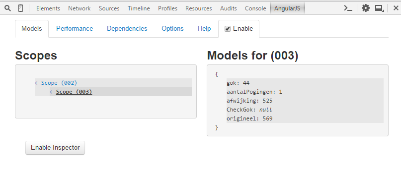

# Project 1: Guess the number

## Model View Controller (MVC)

### Beschrijving componenten

- Model		: bewaren van de business data
- View 		: Voorstelling van de user interface
- Controller	: Verantwoordelijk voor de coordinatie tussen model en view

Elke verandering in het model wordt zichtbaar in de view en visa versa. De controller zorgt er 
eigenlijk voor dat beide in sync blijven. Ter verduidelijking bouwen we een "Raad het getal" applicatie.
We trachten het model eerst op te bouwen door naar de UI en het gedrag van de UI (button click,..) te kijken. Dit 
encapsuleren we in de controller.

### Requirements & Model
 * [Aanmaak van het random getal: bewaren we in de variabele "origineel"]
 * [Mogelijkheid om een getal te raden: bewaren we in de variabele "guess"]
 * [Bijhouden hoeveel keer je gegokt hebt: bewaren we in de variabele "aantalPogingen"]
 * [De gebruiker hints geven op basis van de inut: bewaren we in de variabele "afwijking"]


### opbouw controller

Het gedrag van de View zit eigenlijk in de controller vervat. In AngularJS is de controller een klasse 
(een constructor functie) die het model bevat en heeft een constructie om de view aan zich te binden (dit wil zeggen 
als er iets verandert (bijvoorbeeld een click, of een wijziging in een input veld) de controller er automatisch weet 
van heeft. Dit noemen we databinding.
```html
var app = angular.module("app", []);

app.controller("GuessTheNumberCtrl", function ($scope)
{
    $scope.verifyGuess = function ()
    {
        $scope.afwijking = $scope.origineel - $scope.guess;
        $scope.aantalPogingen = $scope.aantalPogingen + 1;
    }

    $scope.initialize = function ()
    {
        $scope.aantalPogingen = 0;
        $scope.origineel = Math.floor(Math.random() * 1000) + 1;
        $scope.guess = null;
        $scope.afwijking = null;
    }

    $scope.initialize();
});
```

We bemerken $scope.initialize = function() : dit noemen we een "function 
expression", of anonymous function. Een functie zonder naam.

Meer info:
- http://thoughtsonscripts.blogspot.be/2012/01/javascript-anonymous-functions.html


Je merkt op dat de model data vervat zitten in de controller. Het $scope object wordt meegegeven met de controller 
als parameter en alle functies en parameters worden aan dit $scope object gebonden. Dit object zorgt voor de syncronisatie 
met de View.
```html
<body ng-app="app">
    <div ng-controller="GuessTheNumberCtrl">
        <h1>Guess the number</h1>
        your guess: <input type="number" ng-model="guess" />
        <br />
        <button ng-click="verifyGuess()">Verify</button>
        <button ng-click="initialize()">Restart</button>


        <p ng-show="afwijking <0">Te hoog</p>
        <p ng-show="afwijking ==0">Juist!!!</p>
        <p ng-show="afwijking >0">Te laag!!</p>

        <p>Aantal gokken: {{aantalPogingen}}</p>
    </div>

</body>
```
Om Angular te "activeren" in je HTML View, zet je het attribuut (of directive) ng-app in de body. Dit attribuut zorgt 
ervoor dat alle html tags binnen de angular app kunnen fungeren. De "app" zorgt ervoor dat angular kijkt naar een module 
die "app" noemt.
We linken de controller aan de view door in de div-tag het attribuut ng-controller te gebruiken.
Dankzij angular kunnen we onze HTML-tags uitbreiden met bijvoorbeeld: ng-app, ng-controller, ng-model, ng-click, ng-show
, {{ }} , ...
{{ }} : noemen we ook interpolatie symbolen en de ng-* noemen we directives. Alle model eigenschappen en functies worden
toegewezen aan de interpolaties of directives.
Dus {{ aantalPogingen }} zit tussen de interpolatie en is zo gebonden aan de $scope.
Directives zijn speciale constructies (attributen) die de standaard HTML uitbreiden. Ze geven extra gedrag aan deze tags.
(Het is zelfs mogelijk om eigen directives te maken). In ons voorbeeld:
* ng-model: zorgt voor de binding tussen de $scope en de attribuut waarden van ng-model. Bij veranderingen in het input veld
```html <input type="number" ng-model="guess" /> ``` zal de guess variabele in de controller automatisch veranderen, maar ook als
de variabele in de controller zou veranderen zal de UI automatisch updaten.

* ng-click: de click zal een functie in de controller opstarten.

* ng-show: de toont of verbergt elementen gebaseerd op de expressie (true of false).

* ng-controller: linkt de controller aan de view.

We kunnen nog wat extra's doen met bindings en gebruik maken van expressies. De ng-show directive wordt geevalueerd naar
true of false en dus gebruiken we hier expressies: afwijking > 0

Gebruik de chrome extensie batarang voor AngularJS debugging functionaliteit.
Als deze niet werkt, kan je ook Angular JS Batarang (Stable) gebruiken: https://chrome.google.com/webstore/detail/angularjs-batarang-stable/niopocochgahfkiccpjmmpchncjoapek/related




##scope

In Angular kan elk javascript object of primitive  een model zijn. Om een binding te hebben moeten deze parameters aan 
een scope object toegewezen worden.

###Definitie
De scope is een javascript object dat de model properties en functies aan de HTML view bindt.(De scope is geen model, maar
heeft een referentie naar het model).
